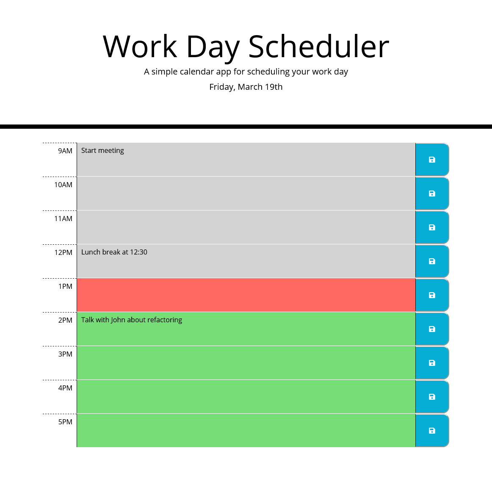

# work-day-scheduler

## Description

This is a work day scheduler.

The user can enter in notes for each hour of the work day and save them.

The notes are saved when the site is closed.

The hours are highlighted according to the current time.

## Site link

The link to the deployed application can be found **[https://nathanhentges.github.io/work-day-scheduler/](https://nathanhentges.github.io/work-day-scheduler/)**.

## Website preview

Below is a screenshot preview of the final website.

